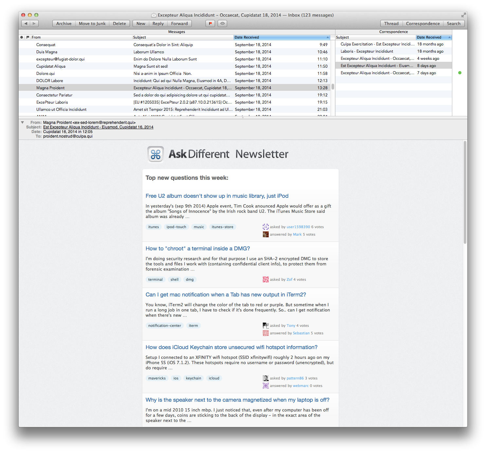
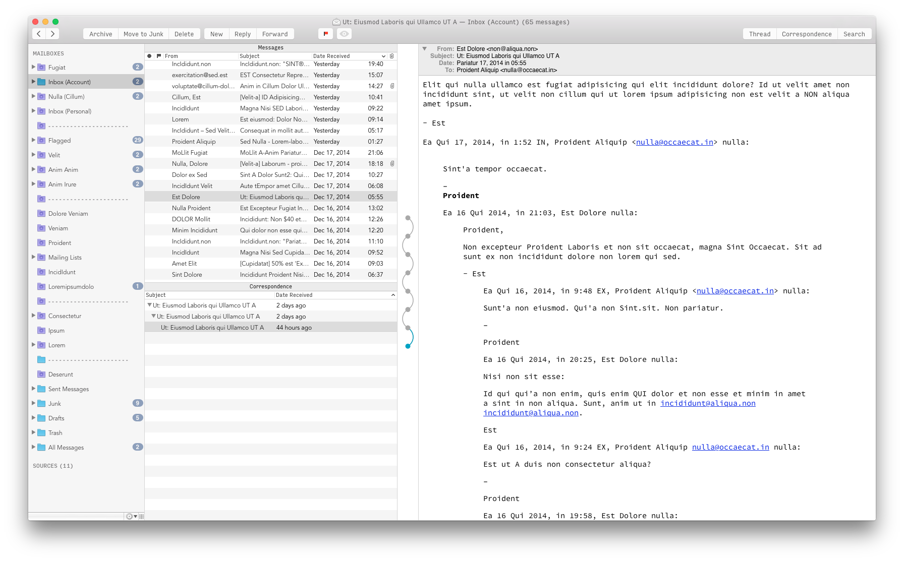

# MailMate Customizations

## Mailbox Layouts

The files [correspondence-arcs.plist](https://github.com/Minotaur881/mailmate/tree/0171e051c18c476b86984873d2d2db31150894d5/Layouts/Mailboxes/correspondence-arcs.plist) and [correspondence-arcs-widescreen.plist](https://github.com/Minotaur881/mailmate/tree/0171e051c18c476b86984873d2d2db31150894d5/Layouts/Mailboxes/correspondence-arcs-widescreen.plist) combine the _Correspondence_ view with the _Thread Arcs_ view. **Correspondence Arcs** is designed more for a taller, more narrow, view, while **Correspondence Arcs \(Widescreen\)** is designed for more for a widescreen layout. Additionally, in **Correspondence Arcs** I often hide the Messages sidebar and either use the Gmail shortcuts or ⌘T to access the _Go to Mailbox_ feature.





## Key bindings

| File | Description |
| :--- | :--- |
| [composer.plist](https://github.com/Minotaur881/mailmate/tree/0171e051c18c476b86984873d2d2db31150894d5/KeyBindings/composer.plist) | Shortcuts for the email composition window |
| [gmail.plist](https://github.com/Minotaur881/mailmate/tree/0171e051c18c476b86984873d2d2db31150894d5/KeyBindings/gmail.plist) | Gmail style shortcuts in the main viewer window |
| [gmail-extended.plist](https://github.com/Minotaur881/mailmate/tree/0171e051c18c476b86984873d2d2db31150894d5/KeyBindings/gmail-extended.plist) | **Custom** Gmail style shortcuts in the main viewer window |
| [trackpad-gestures.plist](https://github.com/Minotaur881/mailmate/tree/0171e051c18c476b86984873d2d2db31150894d5/KeyBindings/trackpad-gestures.plist) | Trackpad gestures as outlined in the manual |

These are fairly self-explanatory if you look through the `plist` files. They should be placed in

```bash
~/Library/Application Support/MailMate/Resources/KeyBindings
```

NOTE: You may need to make the `KeyBindings` folder if you don't already have one. See [Installation](./#installation) below.

### Gmail Keybindings

The key bindings in [gmail.plist](https://github.com/Minotaur881/mailmate/tree/0171e051c18c476b86984873d2d2db31150894d5/KeyBindings/gmail.plist) **are written to provide parity with Gmail,** to the extent that is feasible in MailMate. These go beyond what has already been done with the Gmail key bindings included in MailMate. A table of feature parity may be found in the file [Gmail Shortcuts.md](gmail-shortcuts.md).

I have additionally included a couple of \(IMHO\) improvements to the standard version, which are in [gmail-extended.plist](https://github.com/Minotaur881/mailmate/tree/0171e051c18c476b86984873d2d2db31150894d5/KeyBindings/gmail-extended.plist):

| Shortcut | Description |
| :---: | :--- |
| gu | go to smart mailbox, Unread |
| gg | move to the top of the list \(Vim-style\) |
| ⇧G | move to the bottom \(Vim-style\) |
| r | reply to message and insert salutation in message |
| ⌘⇧F | forward message as an attachment |
| ⇧E | archive all messages in the current thread |
| Z | redo |
| N | select next message for modification |
| P | select previous message for modification |

## Installation

Mailmate user customizations are stored in `~/Library/Application Support/MailMate/Resources`. If you don't have any customizations, I'll suggest doing this:

```bash
mkdir -p "$HOME/Library/Application Support/MailMate/Resources"
git clone https://github.com/chauncey-garrett/mailmate.git "$HOME/Library/Application Support/MailMate/Resources"
```

To set the tags shortcut to `l`, type this in terminal:

```bash
defaults write com.freron.MailMate MmTagsPreferencesKeyEquivalentsColumnEnabled -bool YES
```

Now, relaunch MailMate and set the shortcut in the preferences pane \(MailMate &gt; Preferences... &gt; General &gt; Custom Key Bindings &gt; Enable\). Enable the key bindings that you want by entering them in the box below, e.g. `trackpad-gestures,composer,gmail-extended`.

## Like it?

Add it to your toolbox; if not, open an [issue!](https://github.com/chauncey-garrett/mailmate/issues) I appreciate all feedback.

## Author\(s\)

I specifically want to thank [Benny Kjær Nielsen](http://freron.com/about/index.html#about_me) for making this repository possible by producing [MailMate](http://freron.com), and for providing excellent customer support in regard to how to best make these customizations.

_The author\(s\) of this module should be contacted via the_ [_issue tracker_](https://github.com/chauncey-garrett/mailmate/issues)_._

* [Chauncey Garrett](https://github.com/chauncey-garrett)

[](http://chauncey.io/reader-support/)

